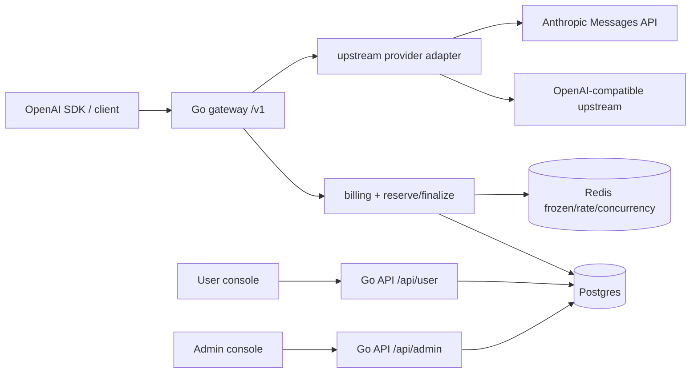

# LingShu Architecture

LingShu is a private AI API aggregation gateway with two roles: administrator
and user. It exposes an OpenAI-compatible `/v1` surface to users, routes calls to
configured upstream channels, and deducts user balance by:

```text
charge = base_cost * rate_multiplier
```

## Runtime Layers



## Billing Flow

1. Authenticate platform API key.
2. Find the enabled public model.
3. Estimate the maximum possible charge.
4. Reserve balance in Redis.
5. Select an enabled, healthy upstream channel with weighted ordering and
   session stickiness.
6. Forward to provider adapter.
7. Settle actual charge in Postgres with row locks.
8. Write `gateway_requests` and `balance_ledger` with matching
   `base_cost`, `rate_multiplier`, and `charge`.
9. Release Redis frozen amount and concurrency counters.

Insufficient balance during reserve returns `402` without producing a charge.
Settlement uses a Postgres transaction and row lock so concurrent requests cannot
drive balance below zero.

## Provider Adapter

The gateway service selects an adapter from `channel.provider_type`:

- `openai`, `custom`, `gemini` - OpenAI-compatible adapter.
- `claude` / `anthropic` - Anthropic adapter.

Adapters live in `backend/internal/upstream` and only translate protocol shape.
They do not own billing decisions. The OpenAI adapter injects
`stream_options.include_usage=true` for streaming requests. The Anthropic adapter
maps OpenAI chat payloads to Anthropic Messages API and converts Anthropic SSE
back into OpenAI-style SSE with a final `usage` frame so existing stream billing
continues to use `ExtractStreamUsage`.

## Frontend

- User console: React + Tailwind v4 + shadcn-style components.
- Admin console: React + Ant Design for operational density.
- Shared package: typed API client and DTO types.

Both frontends use manual vendor chunks. The target is user bundle under 400 KB
gzip and admin bundle under 600 KB gzip.

## Deployment

Docker Compose runs:

- `web`: Nginx serving user/admin SPAs and proxying `/api`, `/v1`, `/healthz`.
- `app`: Go backend.
- `postgres`: durable data.
- `redis`: transient frozen balance, rate windows, concurrency, stickiness.

Production should put TLS in front and restrict admin access to LAN/VPN or an IP
allowlist. Recharge is only via admin manual balance adjustment or redeem codes;
there is no payment gateway, distribution tree, ticket system, or multi-level
permission model.
